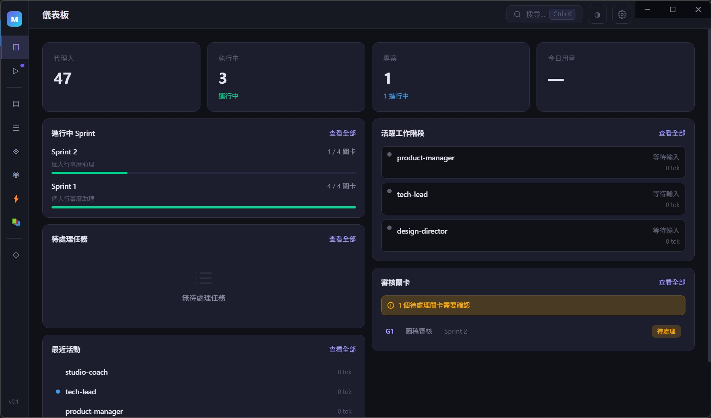
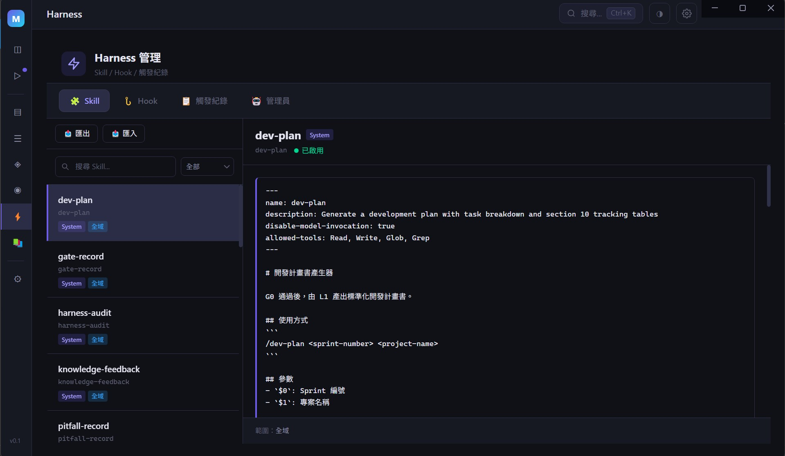
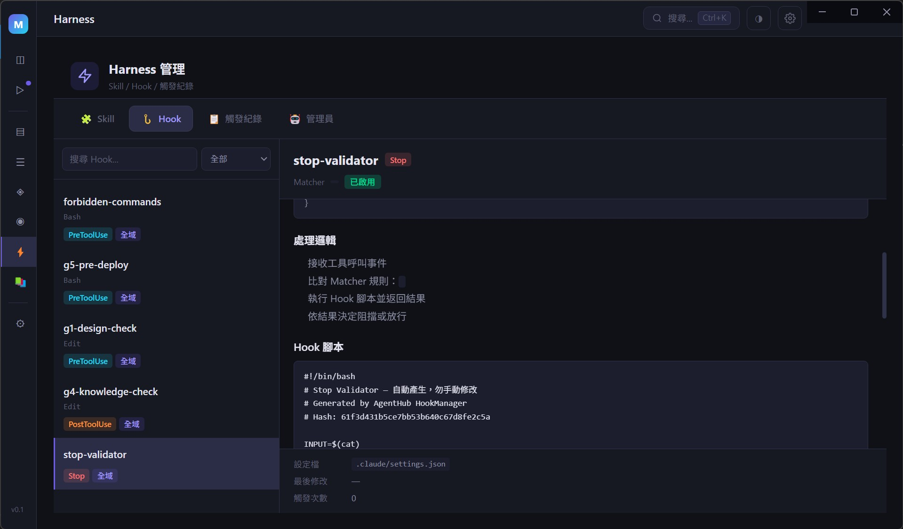
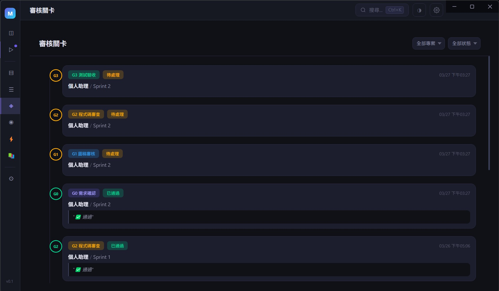
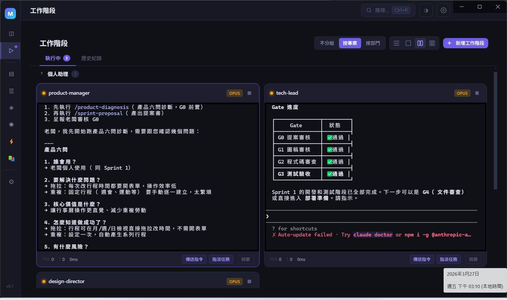
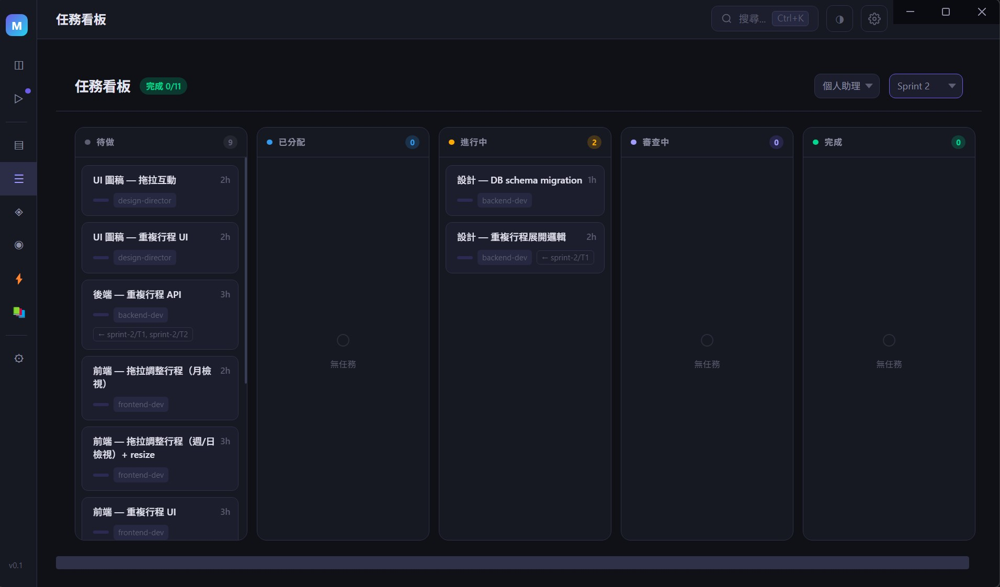
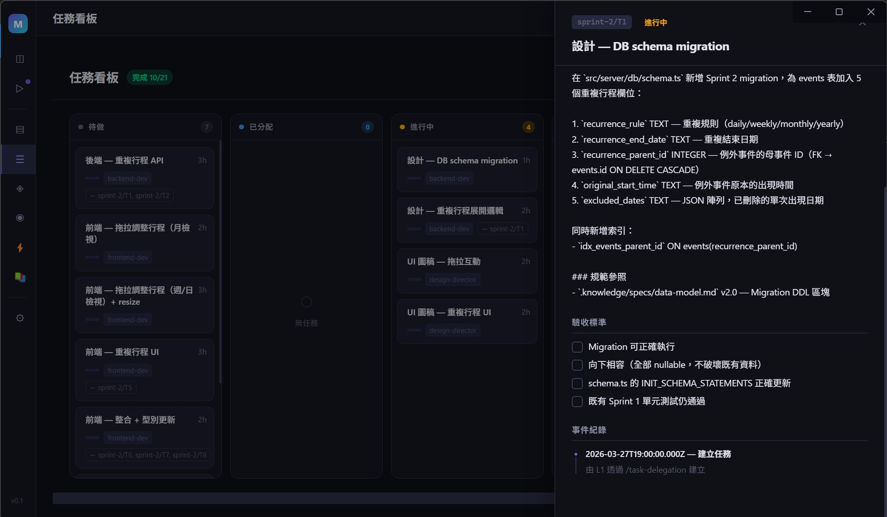
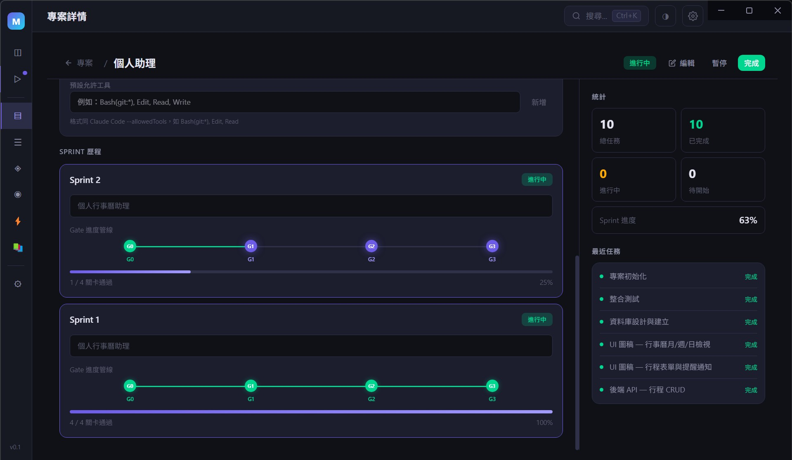
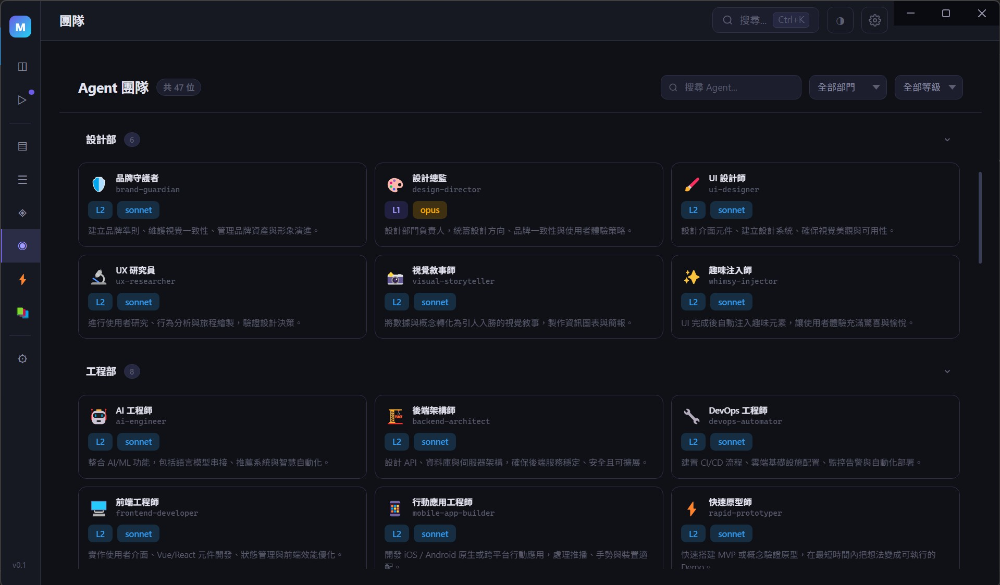
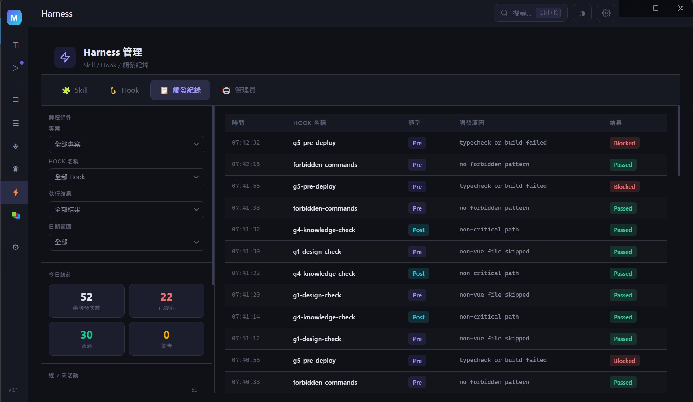

<div align="center">

# AgentHub

### 一個人，一間軟體公司。

用 Claude Code 組建虛擬開發團隊，用 Harness 工程讓 AI 有紀律地工作。

**[官網](https://agenthub-site-mu.vercel.app/)** · **[Claude Code Mastery](https://github.com/Stanshy/Claude-code-mastery)** · **[快速開始](#快速開始)**



</div>

---

AgentHub 不是另一個 AI 聊天介面。

它是一套 **Harness 工程系統**，讓你用 Claude Code 組建一支虛擬開發團隊——有 PM、Tech Lead、前端、後端、設計師——然後像真正的老闆一樣管理他們。

**你下達指令。Agent 執行。Hook 強制品質。Skill 標準化流程。FileWatcher 即時同步。**

沒有 prompt 祈禱，沒有「希望 AI 記得規則」。
規則寫在 Hook 裡，Agent 違反就會被攔截。就這麼簡單。

---

## 你用 Claude Code 寫程式，但你有沒有想過——

- 每次開新 Session，上次的踩坑經驗就消失了
- 你告訴 AI「不要 force push」，它下次還是會忘
- 你花 30 分鐘寫了完美的 prompt，AI 只遵守了前三條
- 多個 Agent 同時工作時，沒人知道誰改了什麼

**AgentHub 解決的不是「AI 不夠聰明」的問題。**
**它解決的是「聰明的 AI 沒有紀律」的問題。**

---

## 為什麼不是「又一個 AI wrapper」？

大多數 AI 工具的思路是：**寫更好的 prompt → 祈禱 AI 照做**。

AgentHub 的思路是：**用架構約束取代文字祈禱**。

| 傳統 AI 工具 | AgentHub |
|-------------|----------|
| 「請記得跑測試」 | Stop Hook：測試沒過，Agent 不准結束 |
| 「請不要亂改共用檔案」 | PreToolUse Hook：危險指令直接攔截 |
| 「請遵守程式碼規範」 | PostToolUse Hook：改了架構檔，強制同步文件 |
| 「請按照流程走」 | Skill：標準化的 Sprint / Review / Gate 流程 |
| 「上次踩過的坑請記住」 | FileWatcher：踩坑紀錄自動同步到所有新專案 |

**好的驗證器 + 差的工作流程，勝過好的工作流程但沒有驗證器。**
這不是口號，是數學：串聯 5 步各 80% 成功率 = 33%。加一個驗證器允許重試 = 99%。

---

## 核心架構：Harness Engineering

就像賽車不只需要好引擎，還需要安全帶、護欄、pit stop 流程。

### Skill — 標準化流程

可重複使用的工作流程模板，Agent 執行時自動載入對應指引。

- `/sprint-proposal` — Sprint 提案書生成
- `/task-dispatch` — 老闆一鍵建立任務，自動寫入計畫書
- `/review` — 自動偵測步驟，選擇對應 Review 類型
- `/gate-record` — Gate 審核紀錄，三層審核鏈（L1→PM→老闆）
- `/pre-deploy` — 部署前自動檢查（CI / 環境變數 / Docker）
- `/harness-audit` — 週期性健康掃描，七大原則逐項評分
- ...共 **23 個內建 Skill**



### Hook — 自動攔截器

不是事後提醒，是當場攔截。Agent 做危險操作時即時阻擋。

- **PreToolUse**：執行指令前檢查（禁止 kill-port / --no-verify / force push main）
- **PostToolUse**：修改檔案後提醒（改了核心服務 → 強制同步 .knowledge/ 文件）
- **Stop**：結束前驗證（測試 + 型別檢查必須通過，否則 Agent 不准停）



### FileWatcher — 即時同步

Markdown 檔案就是資料庫。改了 `.tasks/` 檔案，GUI 即時更新。

```
.tasks/T5.md 被修改
    → chokidar 偵測
    → markdown-parser 解析
    → DB upsert
    → eventBus 廣播
    → Vue 響應式更新
    → GUI 即時反映
```

### Gate — 品質關卡

G0（需求確認）→ G1（設計審核）→ G2（程式碼審查）→ G3（測試驗收）→ G4（文件審查）→ G5（部署就緒）→ G6（正式發佈）

沒通過就不能往下走。不是靠自律，是靠架構強制。



---

## 它長什麼樣？

一個 Electron 桌面應用，暗色主題。

### Sessions — Agent 工作階段

內嵌 xterm.js 終端機，直接在 GUI 中與 Claude Code Agent 互動。



### Task Board — 看板式任務管理

五欄看板，狀態自動流轉。點擊卡片查看完整任務詳情。





### Projects — 子專案管理

一鍵 Scaffold 完整 Harness，即時顯示任務完成率、活躍 Sprint、最新 Gate 狀態。



### Agents — 團隊成員總覽

每個 Agent 有自己的職責定義、權限範圍、回報對象。



### Harness — 觸發紀錄

Hook 執行歷史即時追蹤，篩選、統計、排行一目瞭然。



---

## 團隊架構

你是老闆。下面是你的虛擬開發公司——**9 個部門、46 個 Agent**：

### 指揮鏈

```
老闆（你）
├── L1 領導層（直接匯報老闆）
│   ├── Product Manager        — 產品經理
│   ├── Tech Lead              — 技術總監
│   ├── Design Director        — 設計總監
│   ├── Marketing Lead         — 行銷總監
│   ├── QA Lead                — 測試總監
│   ├── Project Lead           — 專案總監
│   ├── Operations Lead        — 營運總監
│   └── Company Manager        — 公司管理員
│
└── L2 執行層（向 L1 匯報，不得跳級找老闆）
```

### 完整部門名單

**Product 產品部**
| Agent | 職責 |
|-------|------|
| Product Manager | 需求管理、Sprint 規劃、Gate 審核 |
| Feedback Synthesizer | 用戶反饋收集與分析 |
| Sprint Prioritizer | 排定功能優先級 |
| Trend Researcher | 市場趨勢研究 |

**Engineering 工程部**
| Agent | 職責 |
|-------|------|
| Tech Lead | 技術決策、Code Review、架構設計 |
| Frontend Developer | 前端開發（Vue / React） |
| Backend Architect | 後端架構與 API 開發 |
| DevOps Automator | CI/CD、部署、基礎設施 |
| AI Engineer | AI/ML 功能實作 |
| Mobile App Builder | iOS / Android / React Native |
| Rapid Prototyper | 快速原型與 MVP |

**Design 設計部**
| Agent | 職責 |
|-------|------|
| Design Director | UI/UX 設計、設計系統維護 |
| UI Designer | 介面設計與元件庫 |
| UX Researcher | 用戶研究與測試 |
| Visual Storyteller | 視覺敘事與資訊圖表 |
| Brand Guardian | 品牌一致性維護 |
| Whimsy Injector | 注入愉悅的微互動體驗 |

**Marketing 行銷部**
| Agent | 職責 |
|-------|------|
| Marketing Lead | 行銷策略統籌 |
| Content Creator | 跨平台內容生成 |
| Growth Hacker | 用戶增長與病毒式傳播 |
| Twitter Engager | Twitter/X 社群經營 |
| Instagram Curator | Instagram 視覺內容策略 |
| TikTok Strategist | TikTok 短影音策略 |
| Reddit Community Builder | Reddit 社群建設 |
| App Store Optimizer | ASO 關鍵字與轉換率優化 |

**Testing 測試部**
| Agent | 職責 |
|-------|------|
| QA Lead | 測試策略與品質把關 |
| Test Writer Fixer | 撰寫測試、修復失敗 |
| API Tester | API 端點測試 |
| Performance Benchmarker | 效能壓測與基準測試 |
| Test Results Analyzer | 測試結果分析與趨勢 |
| Tool Evaluator | 工具與框架評估 |
| Workflow Optimizer | 工作流程優化 |

**Project Management 專案管理部**
| Agent | 職責 |
|-------|------|
| Project Lead | 專案排程與里程碑 |
| Project Shipper | 發佈協調與上線管理 |
| Studio Producer | 跨部門資源協調 |
| Experiment Tracker | A/B 測試與實驗追蹤 |

**Studio Operations 營運部**
| Agent | 職責 |
|-------|------|
| Operations Lead | 營運統籌 |
| Company Manager | 跨專案知識管理 |
| Harness Manager | Skill/Hook 建立與管理 |
| Analytics Reporter | 數據分析與報告 |
| Finance Tracker | 預算與成本管理 |
| Infrastructure Maintainer | 系統監控與維運 |
| Legal Compliance Checker | 法規合規檢查 |
| Support Responder | 客戶支援 |
| Context Manager | 上下文管理 |

**Bonus 特殊角色**
| Agent | 職責 |
|-------|------|
| Studio Coach | 團隊教練，流程改善建議 |
| Joker | 創意發想，跳脫框架思考 |

每個 Agent 有自己的職責定義檔（`agents/definitions/`）、權限範圍、回報對象。**L2 不能跳過 L1 直接找老闆，老闆不能跳過 L1 直接指揮 L2。** 就像真正的公司。

---

## 技術棧

| 層級 | 技術 |
|------|------|
| 桌面框架 | Electron 35 |
| 前端 | Vue 3 + TailwindCSS 4 |
| 狀態管理 | Pinia |
| 資料庫 | sql.js（WASM SQLite，主進程 in-memory） |
| 終端機 | xterm.js + node-pty |
| AI 引擎 | Claude Code（CLI） |
| 檔案監控 | chokidar |

---

## 前置需求

AgentHub 是 **Claude Code 的上層管理框架**，所有 Agent 的實際工作都透過 Claude Code CLI 執行。

| 必要項目 | 版本 | 說明 |
|---------|------|------|
| **[Node.js](https://nodejs.org/)** | >= 18 | Electron 與前端建置所需（建議 LTS 版本） |
| **npm** | >= 9 | 隨 Node.js 安裝，套件管理 |
| **[Claude Code](https://docs.anthropic.com/en/docs/claude-code)** | 最新版 | Anthropic 官方 CLI 工具，AgentHub 的 AI 引擎。需先安裝並完成認證。 |
| **[Git](https://git-scm.com/)** | >= 2.30 | 版本控制，專案 clone 與 Agent 操作所需 |
| **Python** | >= 3.8 | node-pty 原生模組編譯所需（Windows 需要） |
| **C++ Build Tools** | — | node-pty 原生模組編譯所需（見下方平台說明） |

### 平台安裝說明

**Windows**
```bash
# 安裝 Windows Build Tools（管理員 PowerShell）
npm install --global windows-build-tools
# 或手動安裝 Visual Studio Build Tools（勾選「C++ 桌面開發」工作負載）
```

**macOS**
```bash
# 安裝 Xcode Command Line Tools
xcode-select --install
```

**Linux (Ubuntu/Debian)**
```bash
sudo apt-get install -y build-essential python3
```

> **沒有 Claude Code，AgentHub 只是一個空殼 GUI。** 所有 Skill 執行、Hook 攔截、Agent 對話都依賴 Claude Code CLI。

## 快速開始

```bash
# 1. 確認前置工具已安裝
node --version    # >= 18
claude --version  # Claude Code CLI

# 2. Clone 專案
git clone https://github.com/Stanshy/AgentHub.git
cd AgentHub

# 3. 安裝依賴
npm install

# 4. 啟動開發模式
npm run dev
```

### 可用指令

```bash
npm run dev          # 啟動開發模式（Electron + Vite HMR）
npm run build        # 打包（TypeScript 編譯 + Vite 建置）
npm run typecheck    # TypeScript 型別檢查
npm run test         # 單元測試（Vitest）
npm run test:e2e     # E2E 測試（Playwright）
npm run build:win    # 打包 Windows 安裝檔
npm run build:mac    # 打包 macOS 安裝檔
```

---

## 搭配學習資源

AgentHub 的設計理念來自 **Claude Code Mastery** 課程中的 Harness Engineering 方法論。

如果你想理解 AgentHub 背後的思維模型——為什麼用 Hook 而不是 prompt、為什麼 Skill 比 SOP 文件有效、為什麼 Gate 關卡能把 33% 的成功率拉到 99%——這門課程是最好的起點：

**[Claude Code Mastery](https://github.com/Stanshy/Claude-code-mastery)** — 從零到自主 Agent 團隊的完整指南
**[線上閱讀版](https://claude-code-mastery-site.vercel.app/)** — 網頁版，方便瀏覽

涵蓋 8 個模組、23 章，從 Claude Code 基礎操作到五層進化模型（人工操作 → Prompt 工程 → Harness 工程 → 自主 Agent → Agent 團隊），其中 Module 6 專門講解 AgentHub 使用的 Harness Engineering 架構。

> 你可以單獨使用 AgentHub，也可以搭配課程理解每個設計決策的「為什麼」。

---

## 設計哲學

> 好的驗證器搭配差的工作流程，勝過好的工作流程但沒有驗證器。

1. **給地圖，不給百科全書** — CLAUDE.md 是索引，不是規範全文
2. **用工具強制，不靠 prompt** — 禁止指令寫在 Hook 裡，不是寫在文件裡
3. **知識會累積** — 踩坑紀錄自動收集、跨專案回饋、新專案自動繼承
4. **流程可重複** — Skill 標準化每一步，不依賴個人記憶
5. **品質有保證** — Gate 關卡 + Hook 攔截，雙重保障

---

## 現在能做什麼？未來要去哪？

### 現在（v0.1）— 已實現

**專案管理**
- 建立子專案時自動 Scaffold 完整 Harness（CLAUDE.md + .knowledge/ + Skills + Hooks）
- 支援 4 種專案模板（web-app / api-service / library / mobile-app）
- 專案卡片即時顯示任務完成率、活躍 Sprint、最新 Gate 狀態

**Session & 終端機**
- 內嵌 xterm.js 終端機，直接在 GUI 中開啟 Claude Code Session
- Agent 定義檔自動載入，每個 Session 帶入對應 Agent 的職責與規範
- Session 歷史紀錄與 Token 用量追蹤

**任務看板**
- 五欄看板：Created → Assigned → In Progress → In Review → Done
- Agent 在子專案透過 `/task-start`、`/task-done`、`/task-approve` Skill 更新狀態
- `.tasks/*.md` 檔案變更 → chokidar 偵測 → markdown-parser 解析 → DB 同步 → GUI 即時更新

**Harness 系統**
- **23 個 Skill 模板**：Sprint 提案、任務派工、Code Review、Gate 紀錄、部署前檢查等
- **5 個 Hook 模板**：forbidden-commands（危險指令攔截）、stop-validator（結束前驗證測試+型別檢查）、g1/g4/g5 品質關卡檢查
- 建立專案時自動部署 Skill 和 Hook 到子專案 `.claude/` 目錄
- GUI 可瀏覽、新增、編輯 Hook，支援 global / project 雙範疇

**Gate 品質關卡**
- G0-G6 七個關卡，dev-plan 第 10 節變更時即時同步到 GUI
- Pipeline 視圖顯示每個關卡的審核狀態

**知識庫**
- 瀏覽 `.knowledge/` 目錄樹，Markdown 即時預覽
- 公司規範（coding-standards、api-standards、testing-standards）統一管理

**你的工作模式：** 在 GUI 中開 Session → 跟 Agent 對話下指令 → Agent 在子專案中執行（受 Skill 指引 + Hook 約束）→ 檔案變更即時同步回 GUI → 你在 GUI 上看到結果、審核 Gate。

### 未來（Roadmap）

- **自動指揮鏈**：老闆下一道指令，PM 自動拆解、自動派工給 TL 和 DD，全程無需手動轉達
- **多 Session 並行**：同時開多個 Agent Session，任務自動分配與協調
- **Runtime Guardrail**：TypeScript 引擎即時攔截，不只攔 CLI 指令，還攔程式碼邏輯
- **跨專案知識網路**：A 專案踩的坑，自動變成所有新專案的防護規則

---

## 你不是什麼都不用做。但你只需要做老闆該做的事。

你打開電腦，看到 Dashboard 上顯示——
3 個 Sprint 在進行中，12 個任務分派給不同 Agent，
Tech Lead 剛完成 Code Review，PM 正在準備 Gate 審核，
有一個 Agent 試圖跳過測試，被 Stop Hook 攔下來自動修復了。

你要做的是：決策、審核、方向。
不用做的是：寫 prompt 祈禱、手動跑測試、擔心有人偷懶。

**這就是 AgentHub。**

---

## License

MIT

---

<div align="center">

*Built by a one-person company, for one-person companies.*

**[官網](https://agenthub-site-mu.vercel.app/)** · **[GitHub](https://github.com/Stanshy/AgentHub)** · **[Claude Code Mastery](https://github.com/Stanshy/Claude-code-mastery)**

</div>
